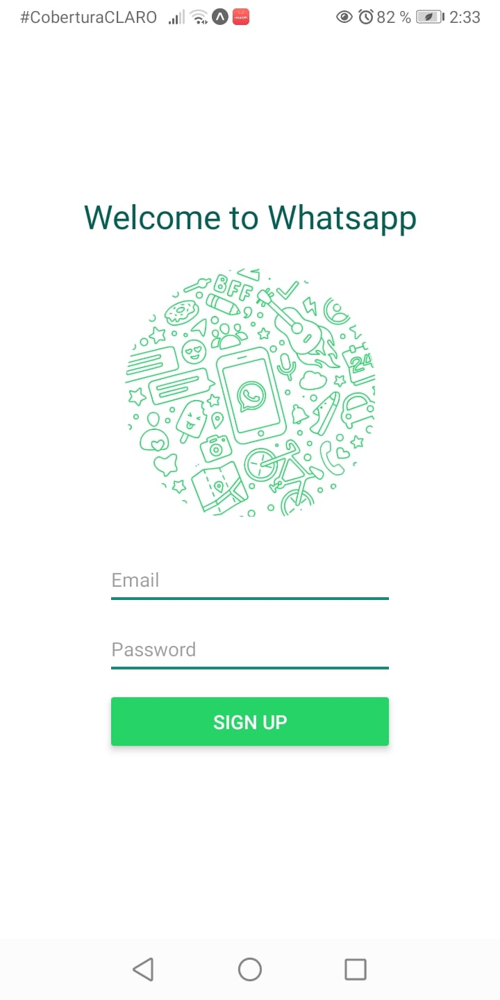
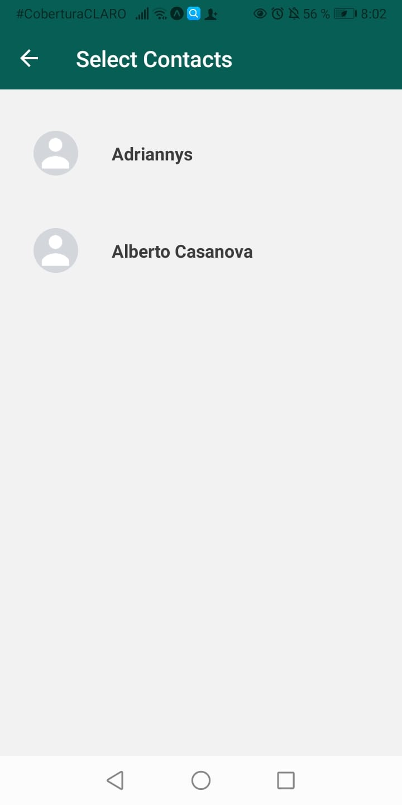
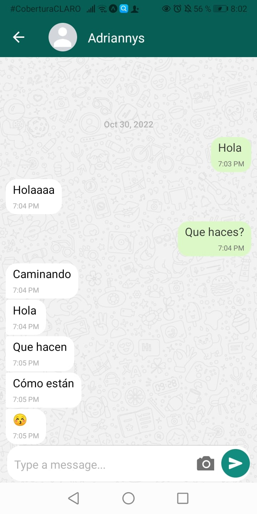

# Whatsapp Clone

    
    

A Whatsapp clone app using React Native and Firebase, this application was made for educational purposes

## Setup

<nav>
    <ol>
        <li>Create a project in Firebase</li>
        <li>Rename the auth.example.json file to auth.json</li>
        <li>Set the variables with the Firebase credentials</li>
        <li>Run the app with npm star</li>
    </ol>
</nav>

## Screenshots

